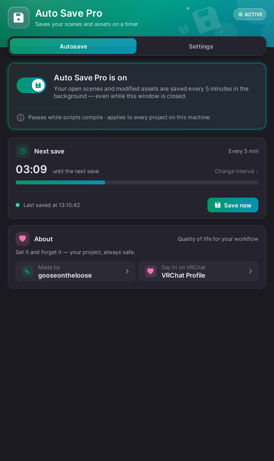
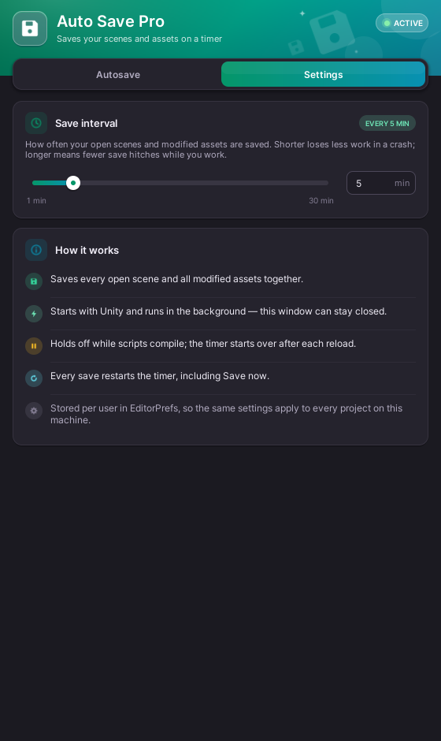

# AutoSavePro for Unity

AutoSavePro is a lightweight, background auto-save utility for the Unity Editor. It ensures project safety by automatically saving scenes and assets at user-defined intervals without requiring the editor window to remain open.

  
  

## Features

- **Background Service**: Operates as a background process using `InitializeOnLoad`, ensuring protection from the moment Unity starts.
- **Dual Saving**: Automatically calls `AssetDatabase.SaveAssets()` and `EditorSceneManager.SaveOpenScenes()` to ensure both project changes and scene modifications are preserved.
- **Persistent Settings**: Configuration for toggle state and save intervals is stored via `EditorPrefs`, maintaining preferences across different sessions and project reloads.
- **Branded Control Panel**: A PawUI editor window (the same look as PawEncrypt): status switch, live countdown with progress bar, interval slider, and Save Now.
- **Compiling Awareness**: Automatically pauses during script compilation to prevent conflicts or performance degradation.
- **Manual Override**: Includes a "Save Now" function for immediate project-wide saves.

## Installation

1. Copy the following into your Unity project under any folder named `Editor` (e.g., `Assets/Editor/`):
   - `AutoSaveProBootstrap.cs`
   - `AutoSaveProWindow.cs`
   - the `PawUI/` folder (the window's UI kit; namespaced `AutoSavePro.PawUI`, so it can't clash with other tools)
2. Allow Unity to compile the scripts.
3. Access the control panel via the top menu: **Tools > Auto Save Pro**.

## Requirements

- Unity 2022.3 (tested; VRChat's version). Older versions are untested - the new UI uses C# 9.
- Standard C# environment.

## Usage

1. **Activation**: Open the tool via **Tools > Auto Save Pro**. By default, the service is enabled upon installation.
2. **Interval**: Adjust the save frequency using the slider (1 to 30 minutes).
3. **Status**: Monitor the "Next save" countdown directly in the window.
4. **Manual Save**: Use the "Save Now" button for an instant manual save of all assets and open scenes.

## Credits

Developed by **gooseontheloose**.

- GitHub: [github.com/gooseontheloose](https://github.com/gooseontheloose)
- VRChat: [Oliver's VRC Profile](https://vrchat.com/home/user/usr_11357725-018b-40b3-9f1c-f891ee1001fd)

## License

This project is provided "as-is" for quality-of-life improvements in Unity development workflows.
